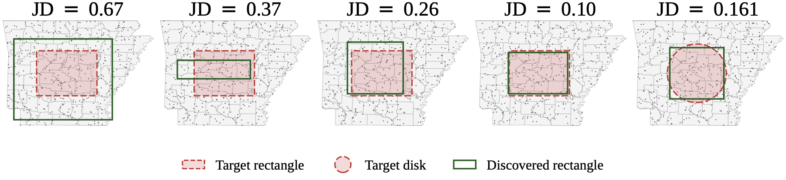
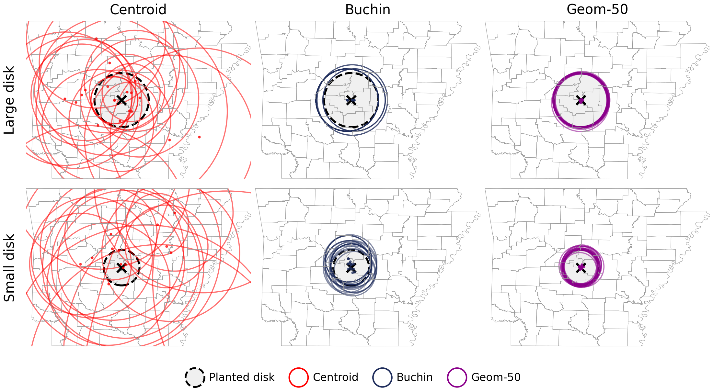

# Sampling for Region-Aggregated Spatial Scan Statistics

<p align="center">
  
</p>
<p align="center"><sub>The discovered scan window (green) converges on the planted target (red rectangle or disk) as the signal strength grows — Jaccard distance falls from 0.67 to 0.10 across five Arkansas-county trials.</sub></p>

<p align="center">
  
</p>
<p align="center"><sub>Disk-shape recovery on Arkansas counties: Centroid (red) degenerates, Buchin (navy) oversizes, Geom-50 (magenta) recovers the planted disk at the right scale on both large (top) and small (bottom) targets.</sub></p>

Code and figure scripts for the paper:

> **Sampling for Region-Aggregated Spatial Scan Statistics.**
> Foad Namjoo, Drew McClelland, Michael Matheny, Jeff M. Phillips.
> *Manuscript under review.*

This repository contains the Python experiments and figure-rendering scripts that reproduce every figure and runtime table in the paper, built on top of [pyScan](https://github.com/michaelmathen/pyscan).

## What's in the paper

We replace each spatial region with `k = 20–50` uniformly-sampled points (instead of a single centroid). This simple change significantly improves the statistical power of point-based spatial scan statistics applied to region-aggregated input (census tracts, zip codes, counties), without changing the underlying scan algorithm. Runtime stays roughly constant because pyScan's fixed-resolution grid scan does not depend on the input point count.

The repo lets you reproduce every claim in the paper from scratch.

## Installation

```bash
git clone https://github.com/foadnamjoo/sampling-region-scan.git
cd sampling-region-scan
python -m venv venv && source venv/bin/activate
pip install -r requirements.txt
```

You also need [pyScan](https://github.com/michaelmathen/pyscan) built locally — see its README for build instructions. Once built, either install it into your venv or point `PYTHONPATH` at the build directory so `import pyscan` works. A few scripts also need the build directory as the working directory at import time; if so, set the `PYSCAN_BUILD` environment variable to the absolute path of `pyscan/build/`.

```bash
export PYTHONPATH=/path/to/pyscan/build
export PYSCAN_BUILD=/path/to/pyscan/build     # only if pyscan needs chdir at import
export DYLD_LIBRARY_PATH=/path/to/pyscan/build/thirdparty/discrepancy:\
/path/to/pyscan/build/thirdparty/kernel/ANN:\
/path/to/pyscan/build/thirdparty/kernel/coreset   # macOS only
```

## Data

The repo does **not** redistribute shapefiles. See [`data/README.md`](data/README.md) for the original sources (US Census, state GIS portals) and download URLs.

## Reproducing the figures

Each figure corresponds to a single script under `src/figures/`. Many figures depend on cached experiment results; run the matching experiment script under `src/experiments/` first.

| Paper figure / table | Experiment | Figure script |
|---|---|---|
| Fig 1 — Arkansas region sampling | — | `src/figures/fig01_arkansas_sampling.py` |
| Fig 2 — JD Arkansas, Geom 5 | `src/experiments/run_arkansas.py` | `src/figures/fig02_jdarkansas.py` |
| Figs 3, 4, 5 — NYC, Utah, California | `src/experiments/run_nyc.py`, `run_utah_california.py` | `src/figures/fig03_06_state_curves.py` |
| Fig 6 — USA counties | (uses cached results) | `src/figures/fig03_06_state_curves.py` |
| Fig 7 — Georgia size sweep | `src/experiments/run_georgia_size.py` | `src/figures/fig07_georgia_size.py` |
| Figs 8, 9 — Arkansas vs FlexScan + Buchin | `src/experiments/run_buchin_rect.py` | `src/figures/fig08_09_arkansas_buchin.py` |
| Fig 12 — Rect map, all methods | `src/experiments/run_buchin_rect.py` | `src/figures/fig12_17_18_buchin_maps.py` |
| Fig 14 — Georgia ablation | `src/experiments/run_georgia_ablation.py` | `src/figures/fig14_georgia_ablation.py` |
| Fig 16 — k-sweep across datasets | (uses cached results) | `src/figures/fig16_k_sweep.py` |
| Figs 17, 18 — Disk Buchin comparison (App B) | `src/experiments/run_buchin_disk.py` | `src/figures/fig12_17_18_buchin_maps.py` |
| Tables 1, 2 — Runtime | `src/experiments/run_runtime.py` | (printed to stdout) |

All outputs are written under `outputs/` (gitignored).

## Repository structure

```
src/
  _paths.py                  Repo-relative path constants
  paper_plots.py             Shared matplotlib styling (v8 / v9)
  shape_floor.py             Shape-family floor computation (Fig 2)
  run_experiment.py          Experiment registry + sampling helpers
  run_buchin_comparison.py   Buchin et al. (2012) Java head-to-head driver
  arkansas_disk_stress.py    Disk-family stress test (Figs 17, 18)
  render_paper_figs_inset.py Inset-map renderer used by several figures
  experiments/               Data-generating scripts (one pickle per run)
  figures/                   Plot rendering — one script per paper figure
data/
  README.md                  Shapefile sources (no data redistributed)
outputs/                     Generated figures and pickles (gitignored)
```

## Citation

> Camera-ready citation will be added after acceptance and publication.

If you'd like to cite the preprint version while the paper is under review, please contact the authors.

## Acknowledgments

This work uses [pyScan](https://github.com/michaelmathen/pyscan) by Michael Matheny. The Buchin et al. (2012) reference implementation was provided directly by the authors and is not redistributed in this repository.

## License

MIT — see [`LICENSE`](LICENSE).
